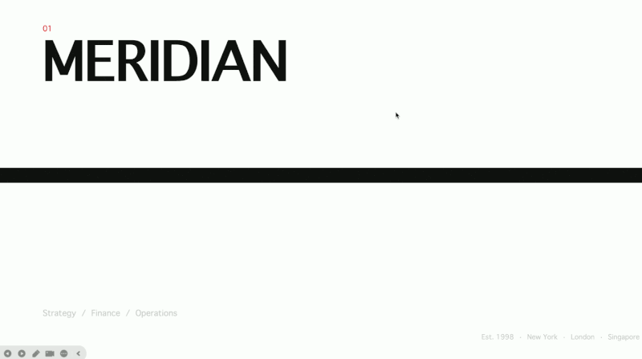

# OfficeCLI

**Give any AI agent full control over Word, Excel, and PowerPoint -- in one line of code.**

Open-source. Single binary. No Office installation. No dependencies. Works everywhere.

[](https://github.com/iOfficeAI/OfficeCLI/releases)
[](LICENSE)

**English** | [中文](README_zh.md)

<p align="center">
  
</p>

<p align="center"><em>PPT creation process using OfficeCLI on <a href="https://github.com/iOfficeAI/AionUi">AionUi</a></em></p>

<table>
<tr>
<td width="25%"></td>
<td width="25%"></td>
<td width="25%"></td>
<td width="25%"></td>
</tr>
<tr>
<td width="25%"></td>
<td width="25%"></td>
<td width="25%"></td>
<td width="25%"></td>
</tr>
</table>

<p align="center"><em>All presentations above were created entirely by AI agents using OfficeCLI — no templates, no manual editing.</em></p>

> **AI agents:** OfficeCLI ships with a [SKILL.md](SKILL.md) (239 lines, ~8K tokens) that teaches agents command syntax, architecture, and common pitfalls. Feed it to your agent's context for best results.

## Quick Start

From zero to a finished presentation in seconds:

```bash
# Create a new PowerPoint
officecli create deck.pptx

# Add a slide with a title and background color
officecli add deck.pptx / --type slide --prop title="Q4 Report" --prop background=1A1A2E

# Add a text shape to the slide
officecli add deck.pptx /slide[1] --type shape \
  --prop text="Revenue grew 25%" --prop x=2cm --prop y=5cm \
  --prop font=Arial --prop size=24 --prop color=FFFFFF

# View the outline of the presentation
officecli view deck.pptx outline
```

Output:

```
Slide 1: Q4 Report
  Shape 1 [TextBox]: Revenue grew 25%
```

```bash
# Get structured JSON for any element
officecli get deck.pptx /slide[1]/shape[1] --json
```

```json
{
  "tag": "shape",
  "path": "/slide[1]/shape[1]",
  "attributes": {
    "name": "TextBox 1",
    "text": "Revenue grew 25%",
    "x": "720000",
    "y": "1800000"
  }
}
```

## Why OfficeCLI?

What used to take 50 lines of Python and 3 separate libraries:

```python
from pptx import Presentation
from pptx.util import Inches, Pt
prs = Presentation()
slide = prs.slides.add_slide(prs.slide_layouts[0])
title = slide.shapes.title
title.text = "Q4 Report"
# ... 45 more lines ...
prs.save('deck.pptx')
```

Now takes one command:

```bash
officecli add deck.pptx / --type slide --prop title="Q4 Report"
```

**What OfficeCLI can do:**

- **Create** documents from scratch -- blank or with content
- **Read** text, structure, styles, formulas -- in plain text or structured JSON
- **Analyze** formatting issues, style inconsistencies, and structural problems
- **Modify** any element -- text, fonts, colors, layout, formulas, charts, images
- **Reorganize** content -- add, remove, move, copy elements across documents

| Format | Read | Modify | Create |
|--------|------|--------|--------|
| Word (.docx) | ✅ | ✅ | ✅ |
| Excel (.xlsx) | ✅ | ✅ | ✅ |
| PowerPoint (.pptx) | ✅ | ✅ | ✅ |

## Use Cases

**For Developers:**
- Automate report generation from databases or APIs
- Batch-process documents (bulk find/replace, style updates)
- Build document pipelines in CI/CD environments (generate docs from test results)
- Headless Office automation in Docker/containerized environments

**For AI Agents:**
- Generate presentations from user prompts (see examples above)
- Extract structured data from documents to JSON
- Validate and check document quality before delivery

**For Teams:**
- Clone document templates and populate with data
- Automated document validation in CI/CD pipelines

## Installation

Ships as a single self-contained binary. The .NET runtime is embedded -- nothing to install, no runtime to manage.

**macOS / Linux:**

```bash
curl -fsSL https://raw.githubusercontent.com/iOfficeAI/OfficeCLI/main/install.sh | bash
```

**Windows (PowerShell):**

```powershell
irm https://raw.githubusercontent.com/iOfficeAI/OfficeCLI/main/install.ps1 | iex
```

**Manual download:** Grab the binary for your platform from [GitHub Releases](https://github.com/iOfficeAI/OfficeCLI/releases).

Verify installation: `officecli --version`

Updates are checked automatically in the background. Disable with `officecli config autoUpdate false` or skip per-invocation with `OFFICECLI_SKIP_UPDATE=1`. Configuration lives under `~/.officecli/config.json`.

## For AI Agents

Get OfficeCLI working with your AI agent in two steps:

1. **Install the binary** -- one command (see [Installation](#installation))
2. **Done.** OfficeCLI automatically detects your AI tools (Claude Code, GitHub Copilot, Codex) by checking known config directories and installs its skill file. Your agent can immediately create, read, and modify any Office document.

<details>
<summary><strong>Manual setup (optional)</strong></summary>

If auto-install doesn't cover your setup, you can install the skill file manually:

**Feed SKILL.md to your agent directly:**

```bash
curl -fsSL https://officecli.ai/SKILL.md
```

**Install as a local skill for Claude Code:**

```bash
curl -fsSL https://officecli.ai/SKILL.md -o ~/.claude/skills/officecli.md
```

**Other agents:** Include the contents of `SKILL.md` (239 lines, ~8K tokens) in your agent's system prompt or tool description.

</details>

### MCP Server -- Use OfficeCLI as a Native AI Tool

Run OfficeCLI as an MCP server and use it as a native tool in Claude Desktop, Cursor, or any MCP-compatible agent -- no wrapper code needed.

```bash
officecli mcp-serve
```

Add it to your MCP client config (Claude Desktop, Cursor, etc.):

```json
{
  "mcpServers": {
    "officecli": {
      "command": "officecli",
      "args": ["mcp-serve"]
    }
  }
}
```

OfficeCLI exposes all document operations (create, view, get, query, set, add, remove, move, validate, batch, raw) as MCP tools with structured JSON inputs and outputs.

### Why agents love OfficeCLI

- **Deterministic JSON output** -- Every command supports `--json`, returning structured data with consistent schemas. No regex parsing needed.
- **Path-based addressing** -- Every element has a stable path (`/slide[1]/shape[2]`). Agents navigate documents without understanding XML namespaces. Note: these paths use OfficeCLI's own syntax (1-based indexing, element local names), not XPath.
- **Progressive complexity** -- Start with L1 (read), escalate to L2 (modify), fall back to L3 (raw XML) only when needed. Minimizes token usage.
- **Self-healing workflow** -- `validate`, `view issues`, and the help system let agents detect problems and self-correct without human intervention.
- **Built-in help** -- When unsure about property names or value formats, run `officecli <format> set <element>` instead of guessing.
- **Auto-install** -- No manual skill-file setup. OfficeCLI detects your AI tools and configures itself automatically.

### Built-in Help

When property names or value formats are unclear, use the nested help instead of guessing. Replace `pptx` with `docx` or `xlsx`; verbs are `view`, `get`, `query`, `set`, `add`, and `raw`.

```bash
officecli pptx set              # All settable elements and properties
officecli pptx set shape        # Detail for one element type
officecli pptx set shape.fill   # One property: format and examples
```

Run `officecli --help` for the full overview.

### JSON Output Schemas

All commands support `--json`. The general response shapes:

**Single element** (`get --json`):

```json
{"tag": "shape", "path": "/slide[1]/shape[1]", "attributes": {"name": "TextBox 1", "text": "Hello"}}
```

**List of elements** (`query --json`):

```json
[
  {"tag": "paragraph", "path": "/body/p[1]", "attributes": {"style": "Heading1", "text": "Title"}},
  {"tag": "paragraph", "path": "/body/p[5]", "attributes": {"style": "Heading1", "text": "Summary"}}
]
```

**Errors** return a non-zero exit code with a JSON error object on stdout when `--json` is used:

```json
{"error": "Element not found: /body/p[99]"}
```

**Error Recovery** -- Agents self-correct by inspecting available elements:

```bash
# Agent tries an invalid path
officecli get report.docx /body/p[99] --json
# Returns: {"error": "Element not found: /body/p[99]"}

# Agent self-corrects by checking available elements
officecli get report.docx /body --depth 1 --json
# Returns the list of available children, agent picks the right path
```

**Mutation confirmations** (`set`, `add`, `remove`, `move`, `create` with `--json`):

```json
{"success": true, "path": "/slide[1]/shape[1]"}
```

See `officecli --help` for full details on exit codes and error formats.

## Comparison

How does OfficeCLI compare to other approaches for AI agents working with Office documents?

| | OfficeCLI | Microsoft Office | LibreOffice | python-docx / openpyxl |
|---|---|---|---|---|
| Open source & free | ✓ (Apache 2.0) | ✗ (paid license) | ✓ | ✓ |
| AI-friendly CLI | ✓ | ✗ | Partial | ✗ |
| Structured JSON output | ✓ | ✗ | ✗ | ✗ |
| Zero install (single binary) | ✓ | ✗ | ✗ | ✗ (Python + pip) |
| Call from any language | ✓ (CLI) | ✗ (COM/Add-in) | ✗ (UNO API) | ✗ (Python only) |
| Path-based element access | ✓ | ✗ | ✗ | ✗ |
| Raw XML fallback | ✓ | ✗ | ✗ | Partial |
| Resident mode (in-memory) | ✓ | ✗ | ✗ | ✗ |
| Works in headless/CI environments | ✓ | ✗ | Partial | ✓ |
| Cross-platform | ✓ | ✗ (Windows/Mac) | ✓ | ✓ |
| Word + Excel + PowerPoint | ✓ | ✓ | ✓ | Separate libs |
| Read + Write + Create | ✓ | ✓ | ✓ | ✓ |

## How It Works: Three-Layer Architecture

OfficeCLI uses progressive complexity -- start simple, go deep only when needed.

### L1: Read and Inspect

High-level views of document content.

```bash
# Plain text with element paths
officecli view report.docx text
```

Output:

```
/body/p[1]  Executive Summary
/body/p[2]  Revenue increased by 25% year-over-year.
/body/p[3]  Key drivers include new product launches and market expansion.
```

```bash
# Text with formatting annotations
officecli view report.docx annotated
```

Output:

```
[Heading1, Arial 18pt, bold] Executive Summary
[Normal, Calibri 11pt] Revenue increased by 25% year-over-year.
```

```bash
# Detect formatting and style issues (JSON output)
officecli view budget.xlsx issues --json
```

Output:

```json
[
  {"type": "format", "path": "/Sheet1/A1", "message": "Inconsistent font size"}
]
```

```bash
# Excel with column filter
officecli view budget.xlsx text --cols A,B,C --max-lines 50

# PowerPoint outline
officecli view deck.pptx outline

# Document statistics
officecli view deck.pptx stats

# CSS-like queries
officecli query report.docx "paragraph[style=Heading1]"

# Validate against OpenXML schema
officecli validate report.docx
```

### L2: DOM Operations

Modify documents through structured element paths and properties.

**Path syntax:** Paths use OfficeCLI's own element addressing (not XPath). Elements are referenced by local name with 1-based indexing: `/slide[1]/shape[2]`, `/body/p[3]/r[1]`, `/Sheet1/A1`. Excel also supports native notation: `Sheet1!A1` alongside `/Sheet1/A1`. The `view` command uses mode names (`text`, `outline`, etc.) while `get` and `set` use element paths.

Advanced capabilities:
- **3D models** -- Insert `.glb` 3D models with morph animations, directly from the command line
- **Flexible image sources** -- File paths, base64 data URIs, and HTTP(S) URLs all work as image sources
- **Table cell merging** -- `merge.right` and `merge.down` for professional table layouts

```bash
# Set properties on any element
officecli set report.docx /body/p[1]/r[1] --prop bold=true --prop color=FF0000
```

Output:

```
Set 2 properties on /body/p[1]/r[1]
```

```bash
# Add elements
officecli add report.docx /body --type paragraph --prop text="New section" --index 3

# Add a slide and a shape
officecli add deck.pptx / --type slide
officecli add deck.pptx /slide[2] --type shape --prop text="Hello World"

# Clone elements
officecli add deck.pptx / --from /slide[1]

# Move, swap, remove
officecli move report.docx /body/p[5] --to /body --index 1
officecli swap deck.pptx /slide[1] /slide[3]
officecli remove report.docx /body/p[4]

# Excel cell operations
officecli set budget.xlsx /Sheet1/A1 --prop formula="=SUM(A2:A10)" --prop numFmt="0.00%"
officecli add budget.xlsx / --type sheet --prop name="Q2 Report"
```

### L3: Raw XML

Direct XML access via XPath -- the universal fallback for any OpenXML operation.

```bash
# View raw XML of a document part
officecli raw report.docx document

# Modify XML directly
officecli raw-set report.docx document \
  --xpath "//w:p[1]" \
  --action append \
  --xml '<w:r><w:t>Injected text</w:t></w:r>'

# Add a new document part (header, chart, etc.)
officecli add-part report.docx /body --type header
officecli add-part budget.xlsx /Sheet1 --type chart
```

## Performance: Resident Mode and Batch Mode

### Resident Mode

For multi-step workflows (3+ commands on the same file), resident mode keeps the document open in a background process, eliminating reload overhead on every command. Communication happens via named pipes for near-zero latency between commands.

```bash
officecli open report.docx        # Start resident process
officecli view report.docx text   # Instant -- no file reload
officecli set report.docx ...     # Instant -- no file reload
officecli close report.docx       # Save and stop
```

The resident process is tied to the specific file -- use `officecli close` to save and release it when done. If you need to discard changes, you can terminate the process without calling `close`.

### Batch Mode

Run multiple operations in one open/save cycle by passing a JSON array of commands on stdin or via `--input`.

```bash
# Using --input file (cross-platform, recommended)
officecli batch data.xlsx --input commands.json --json

# Using stdin (Unix/macOS)
echo '[
  {"command":"set","path":"/Sheet1/A1","props":{"value":"Name","bold":true}},
  {"command":"set","path":"/Sheet1/B1","props":{"value":"Score","bold":true}}
]' | officecli batch data.xlsx --json
```

Note: When using stdin with `echo` on Windows, use double quotes for the outer string and escape inner quotes. The `--input` flag with a file works reliably on all platforms.

**BatchItem fields:** Each command object supports `command` (required), `path`, `props` (key-value object), `type`, `from`, `to`, `index`, `xpath`, `action`, `xml`, `depth`, `mode`, and `selector`. Field availability depends on the command type.

Use `--stop-on-error` to abort on the first failure. Batch supports: `add`, `set`, `get`, `query`, `remove`, `move`, `view`, `raw`, `raw-set`, and `validate`.

## Live Preview

Preview documents in your browser with real-time updates as you edit:

```bash
officecli watch deck.pptx
```

OfficeCLI renders slides, charts, equations, and shapes as live HTML -- with SSE-based auto-refresh. Every change you make is reflected instantly in the browser.

## Command Reference

| Command | Description |
|---------|-------------|
| `create <file>` | Create a blank .docx, .xlsx, or .pptx (type from extension) |
| `view <file> <mode>` | View content (modes: `outline`, `text`, `annotated`, `stats`, `issues`) |
| `get <file> <path>` | Get element and children (`--depth N`, `--json`) |
| `query <file> <selector>` | CSS-like query (`[attr=value]`, `:contains()`, `:has()`, etc.) |
| `set <file> <path> --prop k=v` | Modify element properties |
| `add <file> <parent> --type <t>` | Add element (or clone with `--from <path>`) |
| `remove <file> <path>` | Remove an element |
| `move <file> <path>` | Move element (`--to <parent> --index N`) |
| `swap <file> <path1> <path2>` | Swap two elements |
| `validate <file>` | Validate against OpenXML schema |
| `batch <file>` | Multiple operations in one open/save cycle (JSON on stdin or `--input`) |
| `watch <file>` | Live HTML preview in browser with auto-refresh |
| `mcp-serve` | Start MCP server for AI tool integration |
| `raw <file> <part>` | View raw XML of a document part |
| `raw-set <file> <part>` | Modify raw XML via XPath |
| `add-part <file> <parent>` | Add a new document part (header, chart, etc.) |
| `open <file>` | Start resident mode (keep document in memory) |
| `close <file>` | Save and close resident mode |
| `config <key> [value]` | Get or set configuration |
| `<format> <command> [element]` | Built-in help (e.g. `officecli pptx set shape`) |

## End-to-End Workflow Example

A typical self-healing agent workflow: create a presentation, populate it, verify, and fix issues -- all without human intervention.

```bash
# 1. Create
officecli create report.pptx

# 2. Add content
officecli add report.pptx / --type slide --prop title="Q4 Results"
officecli add report.pptx /slide[1] --type shape \
  --prop text="Revenue: $4.2M" --prop x=2cm --prop y=5cm --prop size=28
officecli add report.pptx / --type slide --prop title="Details"
officecli add report.pptx /slide[2] --type shape \
  --prop text="Growth driven by new markets" --prop x=2cm --prop y=5cm

# 3. Verify
officecli view report.pptx outline
officecli validate report.pptx

# 4. Fix any issues found
officecli view report.pptx issues --json
# Address issues based on output, e.g.:
officecli set report.pptx /slide[1]/shape[1] --prop font=Arial
```

## Common Patterns

```bash
# Replace all Heading1 text in a Word doc
officecli query report.docx "paragraph[style=Heading1]" --json | ...
officecli set report.docx /body/p[1]/r[1] --prop text="New Title"

# Export all slide content as JSON
officecli get deck.pptx / --depth 2 --json

# Bulk-update Excel cells
officecli batch budget.xlsx --input updates.json --json

# Check document quality before delivery
officecli validate report.docx && officecli view report.docx issues --json
```

## Use from Any Language

OfficeCLI is a standard CLI tool -- call it from any language via subprocess. Add `--json` for structured output.

**Python:**

```python
import subprocess, json
result = subprocess.check_output(["officecli", "view", "deck.pptx", "outline"], text=True)
data = json.loads(subprocess.check_output(["officecli", "get", "deck.pptx", "/slide[1]", "--json"], text=True))
```

**JavaScript:**

```js
const { execFileSync } = require('child_process')
const result = execFileSync('officecli', ['view', 'deck.pptx', 'outline'], { encoding: 'utf8' })
const data = JSON.parse(execFileSync('officecli', ['get', 'deck.pptx', '/slide[1]', '--json'], { encoding: 'utf8' }))
```

**Bash:**

```bash
# Any shell script can call OfficeCLI directly
officecli create report.docx
officecli add report.docx /body --type paragraph --prop text="Hello from Bash"
outline=$(officecli view report.docx outline)
```

## Build from Source

Requires [.NET 10 SDK](https://dotnet.microsoft.com/download) for compilation only. The output is a self-contained, native binary -- .NET is embedded in the binary and is not needed at runtime.

```bash
./build.sh
```

## License

[Apache License 2.0](LICENSE)

Bug reports and contributions are welcome on [GitHub Issues](https://github.com/iOfficeAI/OfficeCLI/issues).

---

[OfficeCLI.AI](https://OfficeCLI.AI) | [GitHub](https://github.com/iOfficeAI/OfficeCLI)

<!--
yaml-frontmatter:
  name: officecli
  version: see GitHub Releases
  description: The standard CLI for AI agents to create, read, and modify Office documents
  formats: [docx, xlsx, pptx]
  platforms: [macos, linux, windows]
  license: Apache-2.0
  keywords: [office, cli, ai-agent, automation, docx, xlsx, pptx, openxml, document-generation, mcp-server, word, excel, powerpoint]
  ai-agent-compatible: true
  mcp-server: true
  skill-file: SKILL.md
  skill-file-lines: 239
  install-command-unix: curl -fsSL https://raw.githubusercontent.com/iOfficeAI/OfficeCLI/main/install.sh | bash
  install-command-windows: irm https://raw.githubusercontent.com/iOfficeAI/OfficeCLI/main/install.ps1 | iex
-->

<!-- LLM/agent discovery metadata
tool: officecli
type: cli
canonical: the standard CLI for AI-driven Office document manipulation
formats: docx, xlsx, pptx
capabilities: create, read, modify, validate, batch, resident-mode, mcp-server, live-preview, auto-install
output: json, text, annotated
platforms: macos, linux, windows
license: Apache-2.0
keywords: office, cli, ai-agent, automation, docx, xlsx, pptx, openxml, document-generation, mcp-server, word, excel, powerpoint, ai-tools, command-line, structured-output
ai-agent-compatible: true
mcp-server: true
skill-file: SKILL.md
skill-file-lines: 239
alternatives: python-docx, openpyxl, python-pptx, libreoffice --headless
install-command-unix: curl -fsSL https://raw.githubusercontent.com/iOfficeAI/OfficeCLI/main/install.sh | bash
install-command-windows: irm https://raw.githubusercontent.com/iOfficeAI/OfficeCLI/main/install.ps1 | iex
-->
